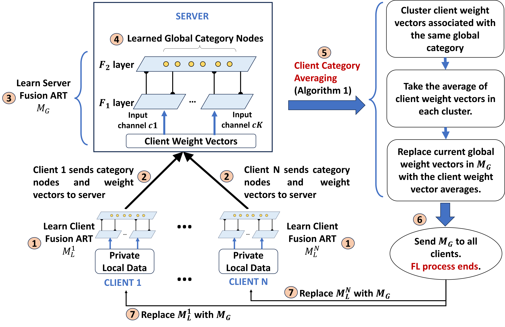

# FedART: A Neural Model Integrating Federated Learning with Adaptive Resonance Theory
This is the source code for FedART (paper under review in IEEE TNNLS).

Description: Federated Learning (FL) is a privacy-aware machine learning paradigm wherein multiple clients combine their locally learned models into a single global model without divulging their private data. However, current FL methods typically assume the use of a fixed network architecture across all the local and global models and they are unable to adapt the architecture of the individual models according to the local data, which is especially important for data that is not Independent and Identically Distributed (non-IID) across different clients. To address this limitation, we propose a novel FL method called Federated Adaptive Resonance Theory (FedART) which leverages the adaptive abilities of self-organizing Adaptive Resonance Theory (ART) neural network models. Based on ART, the client and global models in FedART dynamically adjust and expand their internal structure without being restricted to a predefined static architecture, providing architectural adaptability. In addition, FedART employs a universal learning mechanism that enables both federated clustering, by associating inputs to automatically growing categories, as well as federated classification by coassociating data and class labels. Our experiments conducted on various federated classification and clustering tasks show that FedART consistently outperforms state-of-the-art FL methods for data with non-IID distribution across clients.

## Code Organization:
In the following discussion, `<dataset>` is used as a placeholder for dataset name.
- `fedart_supervised_learning` directory contains the data and source code related to supervised learning (classification).
     - `data/<dataset>` contains the dataset in .csv or .hd5 format. `data/<dataset>/prep_data.py` is used to extract data and save in the .csv file. If you add a new dataset, please implement `data/<dataset>/prep_data.py` for it.
     - `partitioned_data/<dataset>` directory saves the data from `data/<dataset>` after it has been partitioned among different clients.
     - `learned_models/<dataset>` directory saves the local models learned by different clients and the aggregated global model learned after federated learning.
     - `saved_args/<dataset>` directory saves the arguments or parameters related to the given dataset.
     - `src` directory contains the federated learning code.
       - `setup_fl.py` contains the arguments or parameters corresponding to different datasets. It also calls the `run_ccordinator` function to start the `experiment_coordinator` (described below).
       - `experiment_coordinator.py` contains code for loading data from `data/<dataset>`, normalizing it, partitioning it among different clients, doing train-test splits, and preparing data for global testing and training a baseline non-FL centralized model. Furthermore, it creates the directories `partitioned_data`, `learned_models`, and `saved_args`. It saves the partitioned data and the dataset-related arguments while the models are saved later by the clients and server. It also implements functions for evaluating the models.
       - `clients_runner.py`
       -  `server_runner.py`
     - `FedART` directory

## Communication Method
We use simple socket communication for bi-directional send and receive between various clients and server. The clients run in parallel using multiprocessing.

## What you need to change for your own dataset
1. Add your dataset to the `fedart_supervised_learning/data/<dataset>` directory. Extract the data as a Pandas dataframe and save as a .csv or .hd5 file.
2. Provide the arguments or parameters corresponding to the dataset in the `setup_fl.py` file under `get_args` function by using an _if_ statement `if args.dataset == '<dataset>'`.

That's it! You are good to go!

## Dependencies

## How to run everything
